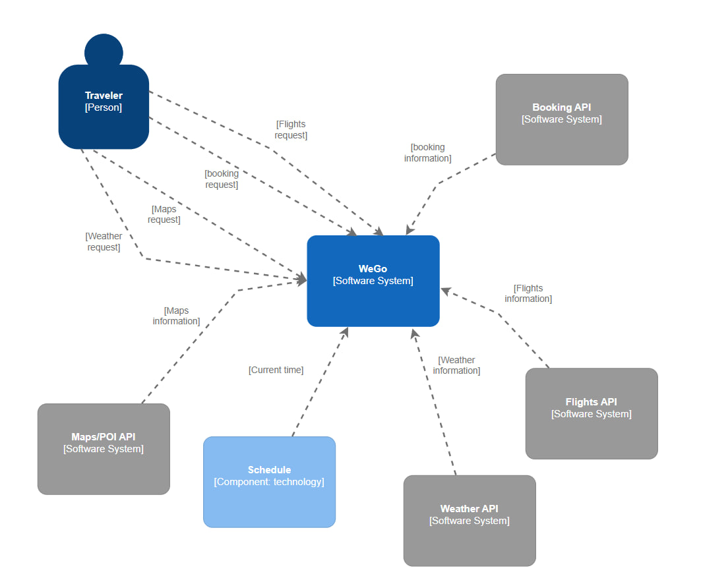

# WeGo - Веб-платформа для комплексного планирования путешествий<br/>

## 1. Назначение проекта:
Создание единой веб-платформы, предназначенной для автоматизации и упрощения процесса планирования пользователями своих путешествий. Платформа предоставляет разрозненную информацию (жилье, достопримечательности, погода).<br/>

## 2. Ключевые функциональные модули:
  * **Модуль бронирования жилья**: Интеграция с API провайдеров бронирования для поиска, сравнения и перехода к резервированию.<br/>
  * **Модуль "Гид по местам"**: База данных точек интереса (POI) с категоризацией (культура, гастрономия, природа и т.д.), описаниями, фотографиями и отзывами.<br/>  
  * **Модуль метеоданных**: Интеграция с weather API для отображения актуального и прогнозируемого состояния погоды в выбранном локации на даты поездки.<br/>
  * **Модуль карт и маршрутизации**: Интеграция картографического сервиса (например, Google Maps, Mapbox).<br/>

## 3. Целевая аудитория:
Самостоятельные путешественники, туристы, тревел-блогеры, планирующие отдых без помощи туроператоров.<br/>

## 4. Ожидаемый результат:
Удобный и интуитивно понятный веб-сервис, который сокращает время на подготовку к поездке и повышает комфорт и осведомленность пользователя во время путешествия.<br/>

# Выработка требований
### 1. Как самостоятельный путешественник, я хочу найти и забронировать жилье, соответствующее моему бюджету и предпочтениям по локации, чтобы мне не приходилось искать на разных сайтах.<br/>
  * Пользователь может ввести город назначения, даты заезда/выезда.<br/>
  * Система отображает список доступных вариантов жилья с фото, ценой, рейтингом и основными удобствами.<br/>
  * Для каждого варианта жилья есть кнопка "Забронировать", которая перенаправляет на сайт партнера.<br/>

### 2. Как тревел-блогер, я хочу видеть прогноз погоды на даты моего путешествия, чтобы понять, какую одежду и оборудование (например, зонт или солнцезащитный крем) мне взять с собой для комфортного отдыха и создания качественного контента.<br/>
  * На странице планирования поездки, после выбора дат и направления, отображается блок с прогнозом погоды.<br/>
  * Прогноз показывает температуру (днем/ночью), вероятность осадков, силу ветра и общее описание (солнечно, облачно) для каждого дня поездки.<br/>

# Разработка архитектуры и детальное проектирование<br/>
### Характер нагрузки на сервис
* Соотношение R/W нагрузки: 90/10. <br/>
  Платформа в основном занимается агрегацией и отображением данных, в то время как запись происходит при создании пользователем маршрута, добавлении в избранное и т.д. <br/>
* Объемы трафика:<br/>
  * Входящий: Невысокий, в основном запросы от клиента (JSON).
  * Исходящий: Высокий, так как сервер отдает клиенту большие объемы данных: списки жилья, фотографии и тд.

### 1 диаграмма C4:


### 2 диаграмма C4:


### Контракты API
* Бронирование: 
``` 
 GET https://whitelabel.travel.yandex-net.ru/hotels/suggest/
   ? query=<string>
   & [region_limit=<integer>]
   & [hotel_limit=<integer>]
   & [affiliate_clid=<string>]
```

* Maps/POI:
```
GET https://search-maps.yandex.ru/v1/
  ? apikey=<string>
  & text=<string>
```

* Weather:
```
GET "https://api.open-meteo.com/v1/forecast?latitude=52.52&longitude=13.41
&past_days=10&hourly=temperature_2m,relative_humidity_2m,wind_speed_10m" 
```

* Flights:
```
GET https://api.aviationstack.com/v1/flights
    ? access_key = YOUR_ACCESS_KEY
```

### Нефункциональные требования
* Время отклика: Среднее время отклика API не должно превышать **500 мс**.
* Доступность: Сервис должен быть доступен **99.9% времени**.
* Масштабируемость: Система должна быть способна обрабатывать увеличение нагрузки в **10 раз** без потери производительности.
* Безопасность: Данные пользователей должны быть защищены.

### Таблицы <br/>
```
users:
id SERIAL PRIMARY KEY 
email VARCHAR(255) UNIQUE NOT NULL 
```

```
trips:
id SERIAL PRIMARY KEY
user_id INTEGER REFERENCES users(id) ON DELETE CASCADE
title VARCHAR(255)
destination VARCHAR(255)
start_date DATE
end_date DATE
```

```
trip_places:
id SERIAL PRIMARY KEY
trip_id INTEGER REFERENCES trips(id) ON DELETE CASCADE
place_id VARCHAR(255),
visit_date DATE
notes TEXT
```

```
poi:
id VARCHAR(255) PRIMARY KEY
name VARCHAR(255)
category VARCHAR(100)
description TEXT
lat DECIMAL(10, 8)
lng DECIMAL(11, 8)
raw_data JSONB
last_updated TIMESTAMPTZ DEFAULT NOW()
```
