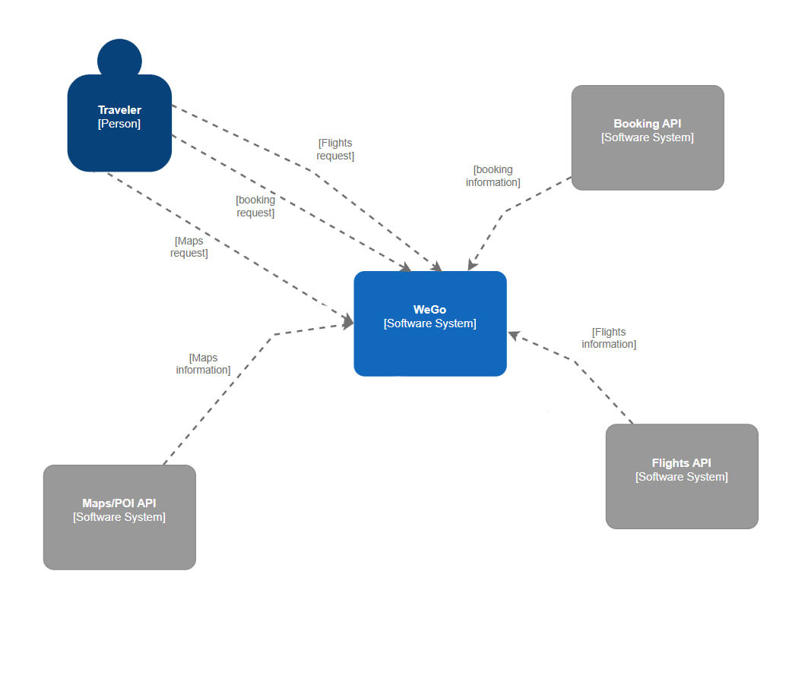

# WeGo - Веб-платформа для комплексного планирования путешествий<br/>

## 1. Назначение проекта:
Создание единой веб-платформы, предназначенной для автоматизации и упрощения процесса планирования пользователями своих путешествий. Платформа предоставляет разрозненную информацию (жилье, достопримечательности, погода).<br/>

## 2. Ключевые функциональные модули:
  * **Модуль бронирования жилья**: Интеграция с API провайдеров бронирования для поиска, сравнения и перехода к резервированию.<br/>
  * **Модуль бронирования билетов**: База данных билетов на самолеты.<br/>  
  * **Модуль карт и маршрутизации**: Интеграция картографического сервиса (например, Google Maps, Mapbox).<br/>

## 3. Целевая аудитория:
Самостоятельные путешественники, туристы, тревел-блогеры, планирующие отдых без помощи туроператоров.<br/>

## 4. Ожидаемый результат:
Удобный и интуитивно понятный веб-сервис, который сокращает время на подготовку к поездке и повышает комфорт и осведомленность пользователя во время путешествия.<br/>

# Выработка требований
### 1. Как самостоятельный путешественник, я хочу найти и забронировать жилье, соответствующее моему бюджету и предпочтениям по локации, чтобы мне не приходилось искать на разных сайтах.<br/>
  * Пользователь может ввести город назначения, даты заезда/выезда.<br/>
  * Система отображает список доступных вариантов жилья с фото, ценой, рейтингом и основными удобствами.<br/>
  * Для каждого варианта жилья есть кнопка "Забронировать", которая перенаправляет на сайт партнера.<br/>

### 2. Как тревел-блогер, я хочу видеть рекомендации по планированию поездки на основе выбранных дат и направления, чтобы понять, как организовать поездку и какие активности запланировать.<br/>
  * На странице планирования поездки, после выбора дат и направления, отображается блок с предложениями по отелям и возможным авиарейсам.<br/>
  * Система показывает доступные отели с датами проживания, количеством гостей и комнат, а также возможные рейсы на выбранные даты.<br/>
  * Это позволяет блогеру спланировать логистику поездки и выбрать оптимальные варианты размещения и перелёта для комфортного отдыха и создания контента.<br/>

# Разработка архитектуры и детальное проектирование<br/>
### Характер нагрузки на сервис
* Соотношение R/W нагрузки: 90/10. <br/>
  Платформа в основном занимается агрегацией и отображением данных, в то время как запись происходит при создании пользователя, добавлении в избранное и т.д. <br/>
* Объемы трафика:<br/>
  * Входящий: Невысокий, в основном запросы от клиента (JSON).
  * Исходящий: Высокий, так как сервер отдает клиенту большие объемы данных: списки жилья, фотографии и тд.

### 1 диаграмма C4:


### 2 диаграмма C4:


### Контракты API
* Бронирование отелей: 
``` 
 GET https://serpapi.com/search?engine=google_hotels
```

* Бронирование авиабилетов:
```
GET https://serpapi.com/search?engine=google_flights
```

* Maps/POI:
```
GET https://serpapi.com/search?engine=google_maps
```


### Нефункциональные требования
* Время отклика: Среднее время отклика API не должно превышать **500 мс**.
* Доступность: Сервис должен быть доступен **99.9% времени**.
* Масштабируемость: Система должна быть способна обрабатывать увеличение нагрузки в **10 раз** без потери производительности.
* Безопасность: Данные пользователей должны быть защищены.

### Таблицы <br/>

